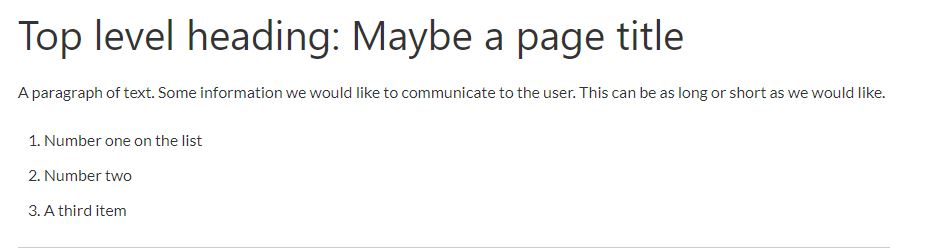

# Basic HTML and HTML5

https://learn.freecodecamp.org/responsive-web-design/basic-html-and-html5

HTML, or HyperText Markup Language, is a markup language used to describe the structure of a web page. It uses a special syntax or notation to organize and give information about the page to the browser. Elements usually have opening and closing tags that surround and give meaning to content. For example, there are different tag options to place around text to show whether it is a heading, a paragraph, or a list. 

## <a name="indice">Índice</a>

1. [Introduction to Basic HTML and HTML5](#parte1)     
2. [Say Hello to HTML Elements](#parte2)     
3. [Headline with the h2 Element](#parte3)     
4. [Inform with the Paragraph Element](#parte4)     
5. [Fill in the Blank with Placeholder Text](#parte5)     
6. [Uncomment HTML](#parte6)     
7. [Comment out HTML](#parte7)     
8. [Delete HTML Elements](#parte8)     
9. [Introduction to HTML5 Elements](#parte9)     
10. [Add Images to Your Website](#parte10)     
11. [Link to External Pages with Anchor Elements](#parte11)     
12. [Link to Internal Sections of a Page with Anchor Elements](#parte12)     
13. [Nest an Anchor Element within a Paragraph](#parte13)     
14. [Make Dead Links Using the Hash Symbol](#parte14)     
15. [Turn an Image into a Link](#parte15)     
16. [Create a Bulleted Unordered List](#parte16)     
17. [Create an Ordered List](#parte17)     
18. [Create a Text Field](#parte18)     
19. [Add Placeholder Text to a Text Field](#parte19)     
20. [Create a Form Element](#parte20)     
21. [Add a Submit Button to a Form](#parte21)     
22. [Use HTML5 to Require a Field](#parte22)     
23. [Create a Set of Radio Buttons](#parte23)     
24. [Create a Set of Checkboxes](#parte24)     
25. [Check Radio Buttons and Checkboxes by Default](#parte25)     
26. [Nest Many Elements within a Single div Element](#parte26)     
27. [Declare the Doctype of an HTML Document](#parte27)     
28. [Define the Head and Body of an HTML Document](#parte28)     
---


## <a name="parte1">1 - Introduction to Basic HTML and HTML5</a>

HTML, or HyperText Markup Language, is a markup language used to describe the structure of a web page. It uses a special syntax or notation to organize and give information about the page to the browser. Elements usually have opening and closing tags that surround and give meaning to content. For example, there are different tag options to place around text to show whether it is a heading, a paragraph, or a list.

For example:

```
<h1>Top level heading: Maybe a page title</h1>

<p>A paragraph of text. Some information we would like to communicate to the viewer. This can be as long or short as we would like.</p>

<ol>
  <li>Number one on the list</li>
  <li>Number two</li>
  <li>A third item</li>
</ol>
```
Becomes:



The HyperText part of HTML comes from the early days of the web and its original use case. Pages usually contained static documents that contained references to other documents. These references contained hypertext links used by the browser to navigate to the reference document so the user could read the reference document without having to manually search for it.

As web pages and web applications grow more complex, the W3 Consortium updates the HTML specification to ensure that a webpage can be shown reliably on any browser. The latest version of HTML is HTML5.

This section introduces how to use HTML elements to give structure and meaning to your web content.

[Voltar ao Índice](#indice)

---


## <a name="parte2">2 - Say Hello to HTML Elements</a>

Welcome to freeCodeCamp's HTML coding challenges. These will walk you through web development step-by-step.

First, you'll start by building a simple web page using HTML. You can edit code in your code editor, which is embedded into this web page.

Do you see the code in your code editor that says <h1>Hello</h1>? That's an HTML element.

Most HTML elements have an opening tag and a closing tag.

Opening tags look like this:

<h1>

Closing tags look like this:

</h1>

The only difference between opening and closing tags is the forward slash after the opening bracket of a closing tag.

Each challenge has tests you can run at any time by clicking the "Run tests" button. When you pass all tests, you'll be prompted to submit your solution and go to the next coding challenge.

```html
<h1>Hello World</h1>
```

[Voltar ao Índice](#indice)

---


## <a name="parte3">3 - Headline with the h2 Element</a>

Over the next few lessons, we'll build an HTML5 cat photo web app piece-by-piece.

The h2 element you will be adding in this step will add a level two heading to the web page.

This element tells the browser about the structure of your website. h1 elements are often used for main headings, while h2 elements are generally used for subheadings. There are also h3, h4, h5 and h6 elements to indicate different levels of subheadings.

Add an h2 tag that says "CatPhotoApp" to create a second HTML element below your "Hello World" h1 element.

```html
<h1>Hello World</h1>
<h2>CatPhotoApp</h2>
```

[Voltar ao Índice](#indice)

---


## <a name="parte4">4 - Inform with the Paragraph Element</a>

p elements are the preferred element for paragraph text on websites. p is short for "paragraph".

You can create a paragraph element like this:

<p>I'm a p tag!</p>

Create a p element below your h2 element, and give it the text "Hello Paragraph".

```html
<h1>Hello World</h1>
<h2>CatPhotoApp</h2>
<p>Hello Paragraph</p>
```

[Voltar ao Índice](#indice)

---


## <a name="parte5">5 - Fill in the Blank with Placeholder Text</a>

Web developers traditionally use lorem ipsum text as placeholder text. The 'lorem ipsum' text is randomly scraped from a famous passage by Cicero of Ancient Rome.

Lorem ipsum text has been used as placeholder text by typesetters since the 16th century, and this tradition continues on the web.

Well, 5 centuries is long enough. Since we're building a CatPhotoApp, let's use something called kitty ipsum text.


Replace the text inside your p element with the first few words of this kitty ipsum text: Kitty ipsum dolor sit amet, shed everywhere shed everywhere stretching attack your ankles chase the red dot, hairball run catnip eat the grass sniff.

```html
<h1>Hello World</h1>

<h2>CatPhotoApp</h2>

<p>Kitty ipsum dolor sit amet, shed everywhere shed everywhere stretching attack your ankles chase the red dot, hairball run catnip eat the grass sniff.</p>
```

[Voltar ao Índice](#indice)

---


## <a name="parte6">6 - Uncomment HTML</a>

Commenting is a way that you can leave comments for other developers within your code without affecting the resulting output that is displayed to the end user.

Commenting is also a convenient way to make code inactive without having to delete it entirely.

Comments in HTML starts with <!--, and ends with a -->

Uncomment your h1, h2 and p elements.

```html

<!--
<h1>Hello World</h1>

<h2>CatPhotoApp</h2>

<p>Kitty ipsum dolor sit amet, shed everywhere shed everywhere stretching attack your ankles chase the red dot, hairball run catnip eat the grass sniff.</p>
-->

```

[Voltar ao Índice](#indice)

---


## <a name="parte7">7 - Comment out HTML</a>

Remember that in order to start a comment, you need to use <!-- and to end a comment, you need to use -->

Here you'll need to end the comment before your h2 element begins.

Comment out your h1 element and your p element, but not your h2 element.

```html
<!--
<h1>Hello World</h1>
-->
<h2>CatPhotoApp</h2>
<!--
<p>Kitty ipsum dolor sit amet, shed everywhere shed everywhere stretching attack your ankles chase the red dot, hairball run catnip eat the grass sniff.</p>
-->
```


[Voltar ao Índice](#indice)

---


## <a name="parte8">8 - Delete HTML Elements</a>

Our phone doesn't have much vertical space.

Let's remove the unnecessary elements so we can start building our CatPhotoApp.

Delete your h1 element so we can simplify our view.

```html
<h2>CatPhotoApp</h2>

<p>Kitty ipsum dolor sit amet, shed everywhere shed everywhere stretching attack your ankles chase the red dot, hairball run catnip eat the grass sniff.</p>
```


[Voltar ao Índice](#indice)

---


## <a name="parte9">9 - Introduction to HTML5 Elements</a>

HTML5 introduces more descriptive HTML tags. These include header, footer, nav, video, article, section and others.

These tags make your HTML easier to read, and also help with Search Engine Optimization (SEO) and accessibility.

The main HTML5 tag helps search engines and other developers find the main content of your page.

Note
Many of the new HTML5 tags and their benefits are covered in the Applied Accessibility section.


Create a second p element after the existing p element with the following kitty ipsum text: Purr jump eat the grass rip the couch scratched sunbathe, shed everywhere rip the couch sleep in the sink fluffy fur catnip scratched.

Wrap the paragraphs with an opening and closing main tag.

```html
<h2>CatPhotoApp</h2>
<main>
    <p>Kitty ipsum dolor sit amet, shed everywhere shed everywhere stretching attack your ankles chase the red dot, hairball run catnip eat the grass sniff.</p>

    <p> Purr jump eat the grass rip the couch scratched sunbathe, shed everywhere rip the couch sleep in the sink fluffy fur catnip scratched.</p>
</main>
```

[Voltar ao Índice](#indice)

---


## <a name="parte10">10 - Add Images to Your Website</a>

You can add images to your website by using the img element, and point to a specific image's URL using the src attribute.

An example of this would be:

```

```

Note that img elements are self-closing.

All img elements must have an alt attribute. The text inside an alt attribute is used for screen readers to improve accessibility and is displayed if the image fails to load.

Note: If the image is purely decorative, using an empty alt attribute is a best practice.

Ideally the alt attribute should not contain special characters unless needed.

Let's add an alt attribute to our img example above:

```

```

Let's try to add an image to our website:

Insert an img tag, before the h2 element.

Now set the src attribute so that it points to this url:

https://bit.ly/fcc-relaxing-cat

Finally don't forget to give your image an alt text.

```html

<h2>CatPhotoApp</h2>
<main>
  <p>Kitty ipsum dolor sit amet, shed everywhere shed everywhere stretching attack your ankles chase the red dot, hairball run catnip eat the grass sniff.</p>
  <p>Purr jump eat the grass rip the couch scratched sunbathe, shed everywhere rip the couch sleep in the sink fluffy fur catnip scratched.</p>
</main>
```

[Voltar ao Índice](#indice)

---


## <a name="parte11">11 - Link to External Pages with Anchor Elements</a>

You can use anchor elements to link to content outside of your web page.

anchor elements need a destination web address called an href attribute. They also need anchor text. Here's an example:

```
<a href="https://freecodecamp.org">this links to freecodecamp.org</a>
```

Then your browser will display the text "this links to freecodecamp.org" as a link you can click. And that link will take you to the web address https://www.freecodecamp.org.

Create an a element that links to http://freecatphotoapp.com and has "cat photos" as its anchor text.

```html
<h2>CatPhotoApp</h2>
<main>
  
  <a href=" http://freecatphotoapp.com">cat photos</a>
  
  
  
  <p>Kitty ipsum dolor sit amet, shed everywhere shed everywhere stretching attack your ankles chase the red dot, hairball run catnip eat the grass sniff.</p>
  <p>Purr jump eat the grass rip the couch scratched sunbathe, shed everywhere rip the couch sleep in the sink fluffy fur catnip scratched.</p>
</main>
```

[Voltar ao Índice](#indice)

---


## <a name="parte12">12 - Link to Internal Sections of a Page with Anchor Elements</a>

Anchor elements can also be used to create internal links to jump to different sections within a webpage.

To create an internal link, you assign a link's href attribute to a hash symbol # plus the value of the id attribute for the element that you want to internally link to, usually further down the page. You then need to add the same id attribute to the element you are linking to. An id is an attribute that uniquely describes an element.

Below is an example of an internal anchor link and its target element:

```
<a href="#contacts-header">Contacts</a>
...
<h2 id="contacts-header">Contacts</h2>
```

When users click the Contacts link, they'll be taken to the section of the webpage with the Contacts header element.


Change your external link to an internal link by changing the href attribute to "#footer" and the text from "cat photos" to "Jump to Bottom".

Remove the target="_blank" attribute from the anchor tag since this causes the linked document to open in a new window tab.

Then add an id attribute with a value of "footer" to the <footer> element at the bottom of the page.

```html
<h2>CatPhotoApp</h2>
<main>
  
  <a href="#footer">Jump to Bottom</a>
  
  
  
  <p>Kitty ipsum dolor sit amet, shed everywhere shed everywhere stretching attack your ankles chase the red dot, hairball run catnip eat the grass sniff. Purr jump eat the grass rip the couch scratched sunbathe, shed everywhere rip the couch sleep in the sink fluffy fur catnip scratched. Kitty ipsum dolor sit amet, shed everywhere shed everywhere stretching attack your ankles chase the red dot, hairball run catnip eat the grass sniff.</p>
  <p>Purr jump eat the grass rip the couch scratched sunbathe, shed everywhere rip the couch sleep in the sink fluffy fur catnip scratched. Kitty ipsum dolor sit amet, shed everywhere shed everywhere stretching attack your ankles chase the red dot, hairball run catnip eat the grass sniff. Purr jump eat the grass rip the couch scratched sunbathe, shed everywhere rip the couch sleep in the sink fluffy fur catnip scratched.</p>
  <p>Meowwww loved it, hated it, loved it, hated it yet spill litter box, scratch at owner, destroy all furniture, especially couch or lay on arms while you're using the keyboard. Missing until dinner time toy mouse squeak roll over. With tail in the air lounge in doorway. Man running from cops stops to pet cats, goes to jail.</p>
  <p>Intently stare at the same spot poop in the plant pot but kitten is playing with dead mouse. Get video posted to internet for chasing red dot leave fur on owners clothes meow to be let out and mesmerizing birds leave fur on owners clothes or favor packaging over toy so purr for no reason. Meow to be let out play time intently sniff hand run outside as soon as door open yet destroy couch.</p>
  
</main>

<footer id="footer">Copyright Cat Photo App</footer>

```

[Voltar ao Índice](#indice)

---


## <a name="parte13">13 - Nest an Anchor Element within a Paragraph</a>

You can nest links within other text elements.

```
<p>
    Here's a <a target="_blank" href="http://freecodecamp.org"> link to freecodecamp.org</a> for you to follow.
</p>
```
Let's break down the example:

Normal text is wrapped in the p element:

```
    <p> Here's a ... for you to follow. </p>
```

Next is the anchor element <a> (which requires a closing tag </a>):

<a> ... </a>

target is an anchor tag attribute that specifies where to open the link and the value "_blank" specifies to open the link in a new tab

href is an anchor tag attribute that contains the URL address of the link:

```
<a href="http://freecodecamp.org"> ... </a>
```

The text, "link to freecodecamp.org", within the anchor element called anchor text, will display a link to click:

```
<a href=" ... ">link to freecodecamp.org</a>
```

The final output of the example will look like this:
Here's a link to freecodecamp.org for you to follow.

Now nest your existing a element within a new p element (just after the existing main element). The new paragraph should have text that says "View more cat photos", where "cat photos" is a link, and the rest of the text is plain text.

```html
<h2>CatPhotoApp</h2>
<main>
  
  
  <p>Kitty ipsum dolor sit amet, shed everywhere shed everywhere stretching attack your ankles chase the red dot, hairball run catnip eat the grass sniff.</p>
  <p>Purr jump eat the grass rip the couch scratched sunbathe, shed everywhere rip the couch sleep in the sink fluffy fur catnip scratched.</p>
</main>
  <p>View more <a href="http://freecatphotoapp.com" target="_blank"> cat photos</a></p>
```

[Voltar ao Índice](#indice)

---


## <a name="parte14">14 - Make Dead Links Using the Hash Symbol</a>

Sometimes you want to add a elements to your website before you know where they will link.

This is also handy when you're changing the behavior of a link using JavaScript, which we'll learn about later.


The current value of the href attribute is a link that points to "http://freecatphotoapp.com". Replace the href attribute value with a #, also known as a hash symbol, to create a dead link.

For example: href="#"

```html
<h2>CatPhotoApp</h2>
<main>
  <p>Click here to view more <a href="#" target="_blank">cat photos</a>.</p>
  
  
  
  <p>Kitty ipsum dolor sit amet, shed everywhere shed everywhere stretching attack your ankles chase the red dot, hairball run catnip eat the grass sniff.</p>
  <p>Purr jump eat the grass rip the couch scratched sunbathe, shed everywhere rip the couch sleep in the sink fluffy fur catnip scratched.</p>
</main>
```

[Voltar ao Índice](#indice)

---


## <a name="parte15">15 - Turn an Image into a Link</a>

You can make elements into links by nesting them within an a element.

Nest your image within an a element. Here's an example:

```
<a href="#"></a>
```

Remember to use # as your a element's href property in order to turn it into a dead link.


Place the existing image element within an anchor element.

Once you've done this, hover over your image with your cursor. Your cursor's normal pointer should become the link clicking pointer. The photo is now a link.

```html
<h2>CatPhotoApp</h2>
<main>
  <p>Click here to view more <a href="#">cat photos</a>.</p>
  
  <a href="#"></a>
  
  <p>Kitty ipsum dolor sit amet, shed everywhere shed everywhere stretching attack your ankles chase the red dot, hairball run catnip eat the grass sniff.</p>
  <p>Purr jump eat the grass rip the couch scratched sunbathe, shed everywhere rip the couch sleep in the sink fluffy fur catnip scratched.</p>
</main>
```

[Voltar ao Índice](#indice)

---


## <a name="parte16">16 - Create a Bulleted Unordered List</a>

HTML has a special element for creating unordered lists, or bullet point style lists.

Unordered lists start with an opening <ul> element, followed by any number of <li> elements. Finally, unordered lists close with a </ul>

For example:

```
<ul>
  <li>milk</li>
  <li>cheese</li>
</ul>
```

would create a bullet point style list of "milk" and "cheese".

Remove the last two p elements and create an unordered list of three things that cats love at the bottom of the page.

```html
<h2>CatPhotoApp</h2>
<main>
  <p>Click here to view more <a href="#">cat photos</a>.</p>
  
  <a href="#"></a>
  
  <ul>
    <li>milk</li>
    <li>cheese</li>
    <li>fish</li>
</ul>
</main>
```

[Voltar ao Índice](#indice)

---


## <a name="parte17">17 - Create an Ordered List</a>


[Voltar ao Índice](#indice)

---


## <a name="parte18">18 - Create a Text Field</a>


[Voltar ao Índice](#indice)

---


## <a name="parte19">19 - Add Placeholder Text to a Text Field</a>


[Voltar ao Índice](#indice)

---


## <a name="parte20">20 - Create a Form Element</a>


[Voltar ao Índice](#indice)

---


## <a name="parte21">21 - Add a Submit Button to a Form</a>


[Voltar ao Índice](#indice)

---


## <a name="parte22">22 - Use HTML5 to Require a Field</a>


[Voltar ao Índice](#indice)

---


## <a name="parte23">23 - Create a Set of Radio Buttons</a>


[Voltar ao Índice](#indice)

---


## <a name="parte24">24 - Create a Set of Checkboxes</a>


[Voltar ao Índice](#indice)

---


## <a name="parte25">25 - Check Radio Buttons and Checkboxes by Default</a>


[Voltar ao Índice](#indice)

---


## <a name="parte26">26 - Nest Many Elements within a Single div Element</a>


[Voltar ao Índice](#indice)

---


## <a name="parte27">27 - Declare the Doctype of an HTML Document</a>


[Voltar ao Índice](#indice)

---


## <a name="parte28">28 - Define the Head and Body of an HTML Document</a>


[Voltar ao Índice](#indice)

---

