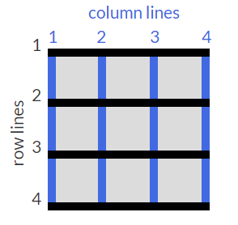

# Introduction to the CSS Grid Challenges

https://learn.freecodecamp.org/responsive-web-design/css-grid

CSS Grid helps you easily build complex web designs. It works by turning an HTML element into a grid container with rows and columns for you to place children elements where you want within the grid. 

## <a name="indice">Índice</a>

1. [Create Your First CSS Grid](#parte1)     
2. [Add Columns with grid-template-columns](#parte2)     
3. [Add Rows with grid-template-rows](#parte3)     
4. [Use CSS Grid units to Change the Size of Columns and Rows](#parte4)     
5. [Create a Column Gap Using grid-column-gap](#parte5)     
6. [Create a Row Gap using grid-row-gap](#parte6)     
7. [Add Gaps Faster with grid-gap](#parte7)     
8. [Use grid-column to Control Spacing](#parte8)     
9. [Use grid-row to Control Spacing](#parte9)     
10. [Align an Item Horizontally using justify-self](#parte10)     
11. [Align an Item Vertically using align-self](#parte11)     
12. [Align All Items Horizontally using justify-items](#parte12)     
13. [Align All Items Vertically using align-items](#parte13)     
14. [Divide the Grid Into an Area Template](#parte14)     
15. [Place Items in Grid Areas Using the grid-area Property](#parte15)     
16. [Use grid-area Without Creating an Areas Template](#parte16)     
17. [Reduce Repetition Using the repeat Function](#parte17)     
18. [Limit Item Size Using the minmax Function](#parte18)     
19. [Create Flexible Layouts Using auto-fill](#parte19)     
20. [Create Flexible Layouts Using auto-fit](#parte20)     
21. [Use Media Queries to Create Responsive Layouts](#parte21)     
22. [Create Grids within Grids](#parte22)     
---


## <a name="parte1">1 - Create Your First CSS Grid</a>

Turn any HTML element into a grid container by setting its display property to grid. This gives you the ability to use all the other properties associated with CSS Grid.

Note  
In CSS Grid, the parent element is referred to as the container and its children are called items.


Change the display of the div with the container class to grid.

```html
<style>
  .d1{background:LightSkyBlue;}
  .d2{background:LightSalmon;}
  .d3{background:PaleTurquoise;}
  .d4{background:LightPink;}
  .d5{background:PaleGreen;}
  
  .container {
    font-size: 40px;
    width: 100%;
    background: LightGray;
    /* add your code below this line */
    display:grid;
    
    /* add your code above this line */
  }
</style>
  
<div class="container">
  <div class="d1">1</div>
  <div class="d2">2</div>
  <div class="d3">3</div>
  <div class="d4">4</div>
  <div class="d5">5</div>
</div>
```

[Voltar ao Índice](#indice)

---


## <a name="parte2">2 - Add Columns with grid-template-columns</a>

Simply creating a grid element doesn't get you very far. You need to define the structure of the grid as well. To add some columns to the grid, use the grid-template-columns property on a grid container as demonstrated below:

```css
.container {
  display: grid;
  grid-template-columns: 50px 50px;
}
```

This will give your grid two columns that are 50px wide each.

The number of parameters given to the grid-template-columns property indicates the number of columns in the grid, and the value of each parameter indicates the width of each column.


Give the grid container three columns that are 100px wide each.

```html
<style>
  .d1{background:LightSkyBlue;}
  .d2{background:LightSalmon;}
  .d3{background:PaleTurquoise;}
  .d4{background:LightPink;}
  .d5{background:PaleGreen;}
  
  .container {
    font-size: 40px;
    width: 100%;
    background: LightGray;
    display: grid;
    /* add your code below this line */
     grid-template-columns: 100px 100px 100px;
    
    /* add your code above this line */
  }
</style>
  
<div class="container">
  <div class="d1">1</div>
  <div class="d2">2</div>
  <div class="d3">3</div>
  <div class="d4">4</div>
  <div class="d5">5</div>
</div>
```


[Voltar ao Índice](#indice)

---


## <a name="parte3">3 - Add Rows with grid-template-rows</a>

The grid you created in the last challenge will set the number of rows automatically. To adjust the rows manually, use the grid-template-rows property in the same way you used grid-template-columns in previous challenge.


Add two rows to the grid that are 50px tall each.

```html
<style>
  .d1{background:LightSkyBlue;}
  .d2{background:LightSalmon;}
  .d3{background:PaleTurquoise;}
  .d4{background:LightPink;}
  .d5{background:PaleGreen;}
  
  .container {
    font-size: 40px;
    width: 100%;
    background: LightGray;
    display: grid;
    grid-template-columns: 100px 100px 100px;
    /* add your code below this line */
    grid-template-rows: 50px 50px;
    
    /* add your code above this line */
  }
</style>
  
<div class="container">
  <div class="d1">1</div>
  <div class="d2">2</div>
  <div class="d3">3</div>
  <div class="d4">4</div>
  <div class="d5">5</div>
</div>
```

[Voltar ao Índice](#indice)

---


## <a name="parte4">4 - Use CSS Grid units to Change the Size of Columns and Rows</a>

You can use absolute and relative units like px and em in CSS Grid to define the size of rows and columns. You can use these as well:

- fr: sets the column or row to a fraction of the available space,
- auto: sets the column or row to the width or height of its content automatically,
- %: adjusts the column or row to the percent width of its container.

Here's the code that generates the output in the preview:

```css
    grid-template-columns: auto 50px 10% 2fr 1fr;
```
This snippet creates five columns. The first column is as wide as its content, the second column is 50px, the third column is 10% of its container, and for the last two columns; the remaining space is divided into three sections, two are allocated for the fourth column, and one for the fifth.


Make a grid with three columns whose widths are as follows: 1fr, 100px, and 2fr.

```html
<style>
  .d1{background:LightSkyBlue;}
  .d2{background:LightSalmon;}
  .d3{background:PaleTurquoise;}
  .d4{background:LightPink;}
  .d5{background:PaleGreen;}
  
  .container {
    font-size: 40px;
    width: 100%;
    background: LightGray;
    display: grid;
    /* modify the code below this line */

    grid-template-columns: 1fr 100px 2fr;
    
    /* modify the code above this line */
    grid-template-rows: 50px 50px;
  }
</style>
  
<div class="container">
  <div class="d1">1</div>
  <div class="d2">2</div>
  <div class="d3">3</div>
  <div class="d4">4</div>
  <div class="d5">5</div>
</div>
```


[Voltar ao Índice](#indice)

---


## <a name="parte5">5 - Create a Column Gap Using grid-column-gap</a>

So far in the grids you have created, the columns have all been tight up against each other. Sometimes you want a gap in between the columns. To add a gap between the columns, use the grid-column-gap property like this:

```css
    grid-column-gap: 10px;
```
This creates 10px of empty space between all of our columns.

Give the columns in the grid a 20px gap.

```html
<style>
  .d1{background:LightSkyBlue;}
  .d2{background:LightSalmon;}
  .d3{background:PaleTurquoise;}
  .d4{background:LightPink;}
  .d5{background:PaleGreen;}
  
  .container {
    font-size: 40px;
    min-height: 300px;
    width: 100%;
    background: LightGray;
    display: grid;
    grid-template-columns: 1fr 1fr 1fr;
    grid-template-rows: 1fr 1fr 1fr;
    /* add your code below this line */
     grid-column-gap:20px;
    
    /* add your code above this line */
  }
</style>
  
<div class="container">
  <div class="d1">1</div>
  <div class="d2">2</div>
  <div class="d3">3</div>
  <div class="d4">4</div>
  <div class="d5">5</div>
</div>
```

[Voltar ao Índice](#indice)

---


## <a name="parte6">6 - Create a Row Gap using grid-row-gap</a>

You can add a gap in between the rows of a grid using grid-row-gap in the same way that you added a gap in between columns in the previous challenge.


Create a gap for the rows that is 5px tall.

```html
<style>
  .d1{background:LightSkyBlue;}
  .d2{background:LightSalmon;}
  .d3{background:PaleTurquoise;}
  .d4{background:LightPink;}
  .d5{background:PaleGreen;}
  
  .container {
    font-size: 40px;
    min-height: 300px;
    width: 100%;
    background: LightGray;
    display: grid;
    grid-template-columns: 1fr 1fr 1fr;
    grid-template-rows: 1fr 1fr 1fr;
    /* add your code below this line */
    grid-row-gap:5px;
    
    /* add your code above this line */
  }
</style>
  
<div class="container">
  <div class="d1">1</div>
  <div class="d2">2</div>
  <div class="d3">3</div>
  <div class="d4">4</div>
  <div class="d5">5</div>
</div>
```

[Voltar ao Índice](#indice)

---


## <a name="parte7">7 - Add Gaps Faster with grid-gap</a>

grid-gap is a shorthand property for grid-row-gap and grid-column-gap from the previous two challenges that's more convenient to use. If grid-gap has one value, it will create a gap between all rows and columns. However, if there are two values, it will use the first one to set the gap between the rows and the second value for the columns.


Use grid-gap to introduce a 10px gap between the rows and 20px gap between the columns.

```html
<style>
  .d1{background:LightSkyBlue;}
  .d2{background:LightSalmon;}
  .d3{background:PaleTurquoise;}
  .d4{background:LightPink;}
  .d5{background:PaleGreen;}
  
  .container {
    font-size: 40px;
    min-height: 300px;
    width: 100%;
    background: LightGray;
    display: grid;
    grid-template-columns: 1fr 1fr 1fr;
    grid-template-rows: 1fr 1fr 1fr;
    /* add your code below this line */
    
    grid-gap:10px 20px;
    /* add your code above this line */
  }
</style>
<div class="container">
  <div class="d1">1</div>
  <div class="d2">2</div>
  <div class="d3">3</div>
  <div class="d4">4</div>
  <div class="d5">5</div>
</div>
```

[Voltar ao Índice](#indice)

---


## <a name="parte8">8 - Use grid-column to Control Spacing</a>

Up to this point, all the properties that have been discussed are for grid containers. The grid-column property is the first one for use on the grid items themselves.

The hypothetical horizontal and vertical lines that create the grid are referred to as lines. These lines are numbered starting with 1 at the top left corner of the grid and move right for columns and down for rows, counting upward.

This is what the lines look like for a 3x3 grid:



To control the amount of columns an item will consume, you can use the grid-column property in conjunction with the line numbers you want the item to start and stop at.

Here's an example:
```css
    grid-column: 1 / 3;
```

This will make the item start at the first vertical line of the grid on the left and span to the 3rd line of the grid, consuming two columns.


Make the item with the class item5 consume the last two columns of the grid.

```html

<style>
  .item1{background:LightSkyBlue;}
  .item2{background:LightSalmon;}
  .item3{background:PaleTurquoise;}
  .item4{background:LightPink;}
  
  .item5 {
    background: PaleGreen;
    /* add your code below this line */
    
    grid-column: 2/4;
    /* add your code above this line */
  }
  
  .container {
    font-size: 40px;
    min-height: 300px;
    width: 100%;
    background: LightGray;
    display: grid;
    grid-template-columns: 1fr 1fr 1fr;
    grid-template-rows: 1fr 1fr 1fr;
    grid-gap: 10px;
  }
</style>
  
<div class="container">
  <div class="item1">1</div>
  <div class="item2">2</div>
  <div class="item3">3</div>
  <div class="item4">4</div>
  <div class="item5">5</div>
</div>

```

[Voltar ao Índice](#indice)

---


## <a name="parte9">9 - Use grid-row to Control Spacing</a>

Of course, you can make items consume multiple rows just like you can with columns. You define the horizontal lines you want an item to start and stop at using the grid-row property on a grid item.


Make the element with the item5 class consume the last two rows.

```html
<style>
  .item1{background:LightSkyBlue;}
  .item2{background:LightSalmon;}
  .item3{background:PaleTurquoise;}
  .item4{background:LightPink;}
  
  .item5 {
    background: PaleGreen;
    grid-column: 2 / 4;
    /* add your code below this line */
    
    grid-row:2/4;
    /* add your code above this line */
  }
  
  .container {
    font-size: 40px;
    min-height: 300px;
    width: 100%;
    background: LightGray;
    display: grid;
    grid-template-columns: 1fr 1fr 1fr;
    grid-template-rows: 1fr 1fr 1fr;
    grid-gap: 10px;
  }
</style>
  
<div class="container">
  <div class="item1">1</div>
  <div class="item2">2</div>
  <div class="item3">3</div>
  <div class="item4">4</div>
  <div class="item5">5</div>
</div>
```

[Voltar ao Índice](#indice)

---


## <a name="parte10">10 - Align an Item Horizontally using justify-self</a>

In CSS Grid, the content of each item is located in a box which is referred to as a cell. You can align the content's position within its cell horizontally using the justify-self property on a grid item. By default, this property has a value of stretch, which will make the content fill the whole width of the cell. This CSS Grid property accepts other values as well:

- start: aligns the content at the left of the cell,
- center: aligns the content in the center of the cell,
- end: aligns the content at the right of the cell.


Use the justify-self property to center the item with the class item2.

```html
<style>
  .item1{background: LightSkyBlue;}
  
  .item2 {
    background: LightSalmon;
    /* add your code below this line */
    
    justify-self:center;
    /* add your code above this line */
  }
  
  .item3{background:PaleTurquoise;}
  .item4{background:LightPink;}
  .item5{background:PaleGreen;}
  
  .container {
    font-size: 40px;
    min-height: 300px;
    width: 100%;
    background: LightGray;
    display: grid;
    grid-template-columns: 1fr 1fr 1fr;
    grid-template-rows: 1fr 1fr 1fr;
    grid-gap: 10px;
  }
</style>
  
<div class="container">
  <div class="item1">1</div>
  <div class="item2">2</div>
  <div class="item3">3</div>
  <div class="item4">4</div>
  <div class="item5">5</div>
</div>
```

[Voltar ao Índice](#indice)

---


## <a name="parte11">11 - Align an Item Vertically using align-self</a>


[Voltar ao Índice](#indice)

---


## <a name="parte12">12 - Align All Items Horizontally using justify-items</a>


[Voltar ao Índice](#indice)

---


## <a name="parte13">13 - Align All Items Vertically using align-items</a>


[Voltar ao Índice](#indice)

---


## <a name="parte14">14 - Divide the Grid Into an Area Template</a>


[Voltar ao Índice](#indice)

---


## <a name="parte15">15 - Place Items in Grid Areas Using the grid-area Property</a>


[Voltar ao Índice](#indice)

---


## <a name="parte16">16 - Use grid-area Without Creating an Areas Template</a>


[Voltar ao Índice](#indice)

---


## <a name="parte17">17 - Reduce Repetition Using the repeat Function</a>


[Voltar ao Índice](#indice)

---


## <a name="parte18">18 - Limit Item Size Using the minmax Function</a>


[Voltar ao Índice](#indice)

---


## <a name="parte19">19 - Create Flexible Layouts Using auto-fill</a>


[Voltar ao Índice](#indice)

---


## <a name="parte20">20 - Create Flexible Layouts Using auto-fit</a>


[Voltar ao Índice](#indice)

---


## <a name="parte21">21 - Use Media Queries to Create Responsive Layouts</a>


[Voltar ao Índice](#indice)

---


## <a name="parte22">22 - Create Grids within Grids</a>


[Voltar ao Índice](#indice)

---

